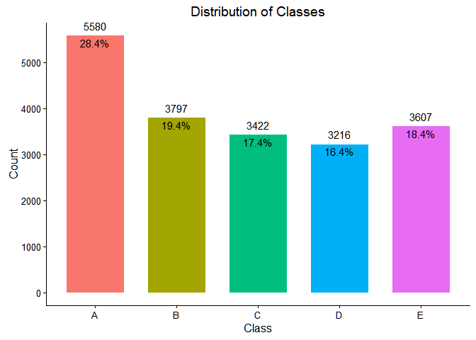
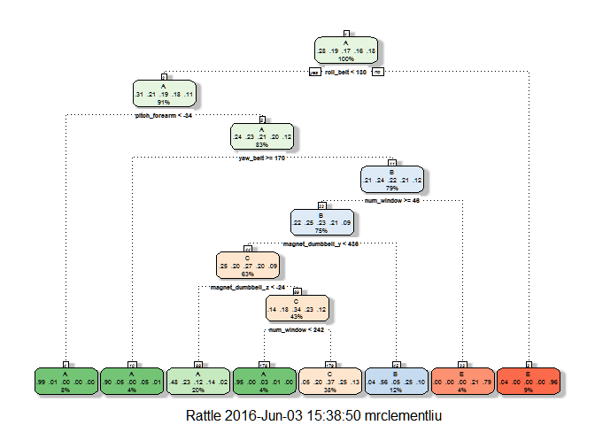

# Applying Machine Learning on Quantified Self Data
Clement Liu  
June 3, 2016  

# Background

Using devices such as *Jawbone Up*, *Nike FuelBand*, and *Fitbit* it is now possible to collect a large amount of data about personal activity relatively inexpensively. These type of devices are part of the quantified self movement - a group of enthusiasts who take measurements about themselves regularly to improve their health, to find patterns in their behavior, or because they are tech geeks. One thing that people regularly do is quantify how *much* of a particular activity they do, but they rarely quantify *how well the do it*. In this project, the goal is to use data from accelerometers on the belt, forearm, arm, and dumbbell of 6 participants. They were asked to perform barbell lifts correctly and incorrectly in 5 different ways. More information is available from the website here: [http://groupware.les.inf.puc-rio.br/har](http://groupware.les.inf.puc-rio.br/har).

# Abstract

The purpose of this project is to use prediction algorithms to accurately predict the "class" of a unilateral dumbbell biceps curl based on the data captured by the accelerometers worn by the experiment participants. For each of the 6 participants, each curl was classified as "Class A" for being performed exactly according to specifications, otherwise it was classified as "Class B", "Class C", "Class D", or "Class E" for incurring one of the four common mistakes.

# Necessary Libraries


```r
options(width = 100)
library(scales)  # To convert the scale to percentages
library(caret)  # For prediction functions 
library(ggplot2)  # For display plots
library(rpart)  # For the decision trees
library(dplyr)  # Data manipulation
library(rattle)  # To display the decision trees
library(randomForest)  # Random Forest
library(e1071)  # Support vector machine
```

# Exploratory Analysis

Taking a look at the distribution of the classes below, we see that ~28% of the biceps curls were done correctly and ~72% of the biceps curls were done incorrectly. The below distribution gives us a baseline of what to expect for our predictions.


```r
training <- read.csv("https://d396qusza40orc.cloudfront.net/predmachlearn/pml-training.csv")
testing <- read.csv("https://d396qusza40orc.cloudfront.net/predmachlearn/pml-testing.csv")

ggplot(training, aes(x = classe)) + geom_bar(aes(fill = classe), width = 0.7) + geom_text(aes(label = ..count..), 
    stat = "count", vjust = -0.7, size = 4) + geom_text(aes(label = scales::percent((..count..)/sum(..count..))), 
    stat = "count", vjust = 1.3, size = 4) + guides(fill = FALSE) + scale_y_continuous(breaks = 0:5 * 
    1000) + ggtitle("Distribution of Classes") + xlab("Class") + ylab("Count") + theme_classic()
```



# Data Cleaning

I removed all of the columns that were identifiers, were empty, or contained all NAs because these columns would skew the results in the prediction algorithms during the model building process. The columns to remove were identified by using View on the data. The data was cleaned the same way for both the training as well as the testing data sets in order to maintain consistency.


```r
training_clean <- training[, -c(1:6, 12:36, 50:59, 69:83, 87:101, 103:112, 125:139, 141:150)]
testing_clean <- testing[, -c(1:6, 12:36, 50:59, 69:83, 87:101, 103:112, 125:139, 141:150)]
```

# Cross-Validation

The dataset provided by Groupware@LES contained 19,622 observations for training and 20 observations for testing. Only the training observations will be used in the model building process. These 19,622 observations will be split into 75% for training and 25% for validating. This is done because the model accuracy tend to be overly optimistic when calculated against the data it was built on. By first testing the model against the validation dataset (which was not used to build the model), we can get a sense of the out-of-sample error as well as how the model will perform on independent data sets (in this case, for the 20 testing observations).


```r
set.seed(1000)
training_index <- createDataPartition(training_clean$classe, p = 3/4)[[1]]

train <- training_clean[training_index, ]
validate <- training_clean[-training_index, ]
test <- testing_clean
```

# Model Selection

For the sake of consistency, the predictors and the results were renamed. Then I will build three models -- an SVM, a decision tree, and a random forest -- in order to select the algorithm to use.


```r
train_predictors <- as.data.frame(train[, -54])
train_classe <- train$classe

validate_predictors <- as.data.frame(validate[, -54])
validate_classe <- validate$classe

test_predictors <- as.data.frame(test[, -54])
```

## Support Vector Machine (SVM)


```r
model_svm <- svm(classe ~ ., data = train, cost = 100, gamma = 1)
```

First, I try to predict using the Support Vector Machine (SVM). As we can see from the misclassification table below, using this model to predict the training set generates an accuracy of 1. This would seem like a classic case of overfitting.


```r
table(predict(model_svm, train), train_classe)
```

```
##    train_classe
##        A    B    C    D    E
##   A 4185    0    0    0    0
##   B    0 2848    0    0    0
##   C    0    0 2567    0    0
##   D    0    0    0 2412    0
##   E    0    0    0    0 2706
```

Taking a look at the accuracy against the validation set, we see a result of 0.94066, which is still quite remarkable. The misclassification table suggests that most of the errors occur with the observations categorized as "Class E".


```r
table(predict(model_svm, validate), validate_classe)
```

```
##    validate_classe
##        A    B    C    D    E
##   A 1319    1    0    0    0
##   B    6  894    1    0    0
##   C    0    0  793    1    0
##   D    0    0    5  706    0
##   E   70   54   56   97  901
```

With an accuracy rate of 0.94066 on the validation set, the SVM is a model worth considering.

## Decision Tree


```r
model_tree <- train(train_predictors, train_classe, method = "rpart")
```

Next, I tried to predict using decision trees. Taking a look at the misclassification table against the training data, it becomes apparent that the approach is flawed. The accuracy rate of 0.58269 is significantly below that of the SVM. In fact, the algorithm does not capture any observations into "Class D".


```r
table(predict(model_tree, train), train_classe)
```

```
##    train_classe
##        A    B    C    D    E
##   A 3795  740  394  451   76
##   B   72  975   81  435  182
##   C  267 1133 2092 1410  734
##   D    0    0    0    0    0
##   E   51    0    0  116 1714
```

That result is consistent against the validation set. It has an accuracy of 0.57484, and there are no observations in "Class D".


```r
table(predict(model_tree, validate), validate_classe)
```

```
##    validate_classe
##        A    B    C    D    E
##   A 1265  240  154  148   25
##   B   23  324   28  145   72
##   C   84  385  673  481  247
##   D    0    0    0    0    0
##   E   23    0    0   30  557
```

Here is a look at the dendrogram, but we will not further consider the decision tree as a viable model for this prediction.


```r
fancyRpartPlot(model_tree$finalModel)
```



## Random Forest


```r
model_rf <- randomForest(train_predictors, train_classe)
```

The last algorithm I will try is the random forest. Against the training data, the model has an accuracy rate of 1. 


```r
table(predict(model_rf, train), train_classe)
```

```
##    train_classe
##        A    B    C    D    E
##   A 4185    0    0    0    0
##   B    0 2848    0    0    0
##   C    0    0 2567    0    0
##   D    0    0    0 2412    0
##   E    0    0    0    0 2706
```

This would look like a case of overfitting, but the model works just as well against the validation data. It also has an accuracy rate of 0.99816.


```r
table(predict(model_rf, validate), validate_classe)
```

```
##    validate_classe
##        A    B    C    D    E
##   A 1395    0    0    0    0
##   B    0  949    3    0    0
##   C    0    0  852    2    0
##   D    0    0    0  801    3
##   E    0    0    0    1  898
```

# Conclusion

With a validation accuracy of 0.99816, I choose the Random Forest model to predict the test set data.

These are the predictions for the testing data set.


```r
predict(model_rf, test_predictors, type = "class")
```

```
##  1  2  3  4  5  6  7  8  9 10 11 12 13 14 15 16 17 18 19 20 
##  B  A  B  A  A  E  D  B  A  A  B  C  B  A  E  E  A  B  B  B 
## Levels: A B C D E
```
